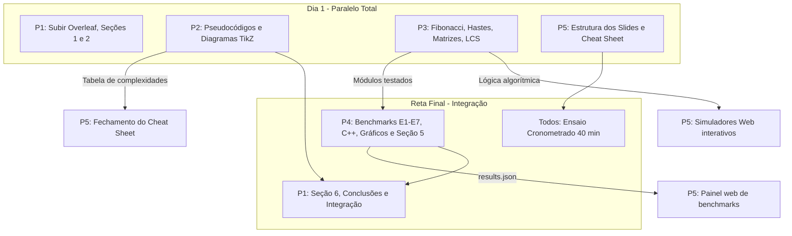

# Quadro Geral de Tarefas - Programação Dinâmica (AEDS-II)

Este documento centraliza a alocação de responsabilidades, o fluxo de dependências e o status de desenvolvimento do trabalho em equipe.

---

## 1. Matriz de Responsabilidades

| Resp. | Integrante | Frente de Trabalho | Arquivo de Instruções | Depende de | Status |
| :--- | :--- | :--- | :--- | :--- | :---: |
| **P1** | [Nome 1] | **Relatório**: Seções 1, 2, 6, referências e montagem final | [`docs/tarefas/P1_relatorio_secoes_1_2_6.md`](tarefas/P1_relatorio_secoes_1_2_6.md) | Nenhum para iniciar; montagem final depende de todos | [ ] Em aberto |
| **P2** | [Nome 2] | **Relatório**: Seções 3 e 4 (modelagem, pseudocódigos, TikZ, análise) | [`docs/tarefas/P2_relatorio_secoes_3_4.md`](tarefas/P2_relatorio_secoes_3_4.md) | Assinaturas dos stubs (já prontas) | [ ] Em aberto |
| **P3** | [Nome 3] | **Código Base**: Algoritmos do Cormen em Python e validação de testes | [`docs/tarefas/P3_codigo_base.md`](tarefas/P3_codigo_base.md) | Nenhum (início imediato) | [ ] Em aberto |
| **P4** | [Nome 4] | **Estudos de Caso & Benchmarks**: Diff, DNA, C++, medições, gráficos, Seção 5 | [`docs/tarefas/P4_estudo_de_caso_e_benchmarks.md`](tarefas/P4_estudo_de_caso_e_benchmarks.md) | **P3** (funções prontas para instrumentar) | [ ] Em aberto |
| **P5** | [Nome 5] | **Comunicação Visual & Web**: Cheat sheet, slides (40 min) e simuladores web | [`docs/tarefas/P5_cheatsheet_slides_e_web.md`](tarefas/P5_cheatsheet_slides_e_web.md) | **P3** (código) e **P4** (dados) para partes específicas | [ ] Em aberto |

---

## 2. Ordem Sugerida de Execução e Paralelismo

### O que pode ser feito em paralelo desde o primeiro dia:
- **P1**: Configura o Overleaf, escreve a introdução em funil e a fundamentação teórica formal.
- **P2**: Escreve os pseudocódigos em `algorithm2e`, desenha os diagramas TikZ e deduz as análises assintóticas formais.
- **P3**: Implementa os algoritmos de referência módulo a módulo (`fibonacci` $\to$ `rod_cutting` $\to$ `matrix_chain` $\to$ `lcs`), fazendo push assim que cada um passar nos testes.
- **P5**: Estrutura a apresentação de slides (seguindo [`ROTEIRO_SLIDES.md`](ROTEIRO_SLIDES.md)), monta a estrutura do cheat sheet e inicia as interfaces web que não dependem de dados reais (`fib-tree.html`, `rod-cutting-duel.html`, `quiz.html`).

### O que espera outra pessoa:
- **P4** depende de **P3** para ter as funções prontas para rodar os benchmarks (`benchmarks/run_benchmarks.py`). *Enquanto P3 implementa, P4 pode adiantar os estudos de caso (`diff_tool.py`, `dna_alignment.py`) e a compilação de `cpp/lcs.cpp`*.
- **P5** depende dos dados consolidados de **P4** (`web/data/results.json`) para ligar o gráfico interativo de `web/benchmarks.html`.
- **P1** depende das seções de **P2** e **P4** para a revisão final cruzada e montagem do PDF definitivo.

> [!TIP]
> **Colaboração Ágil:** A divisão de tarefas é uma referência organizada. Se você concluir sua parte antes dos demais, apoie os colegas com maior sobrecarga de implementação (normalmente **P5** com os simuladores web ou **P4** com as medições e gráficos).

---

## 3. Onde Entra a Multiplicação em Cadeia de Matrizes?

A **Cadeia de Matrizes** (Cormen Seção 15.2) é um pilar obrigatório do projeto e perpassa todas as frentes de trabalho:
- **P3**: Implementação de `matrix_chain_naive`, `matrix_chain_memo`, `matrix_chain_order`, `optimal_parens` e `count_parenthesizations` em `src/matrix_chain.py`.
- **P4**: Experimento **E7** (tempo da PD vs. crescimento combinatório dos números de Catalan).
- **P2**: Pseudocódigos de `Matrix-Chain-Order` e `Print-Optimal-Parens`, diagrama TikZ das tabelas $m$ e $s$ e análise assintótica $\Theta(n^3)$ tempo e $\Theta(n^2)$ espaço.
- **P1**: Fundamentação da explosão combinatória dos números de Catalan $C(n-1) = \Omega(4^n / n^{3/2})$.
- **P5**: Bloco dedicado no seminário (dinâmica com a turma) e simulador interativo em `web/matrix-chain.html`.

Consulte o documento completo com fundamentação, tabelas e dinâmica em:
👉 [`docs/tarefas/EXTRA_cadeia_de_matrizes.md`](tarefas/EXTRA_cadeia_de_matrizes.md)
